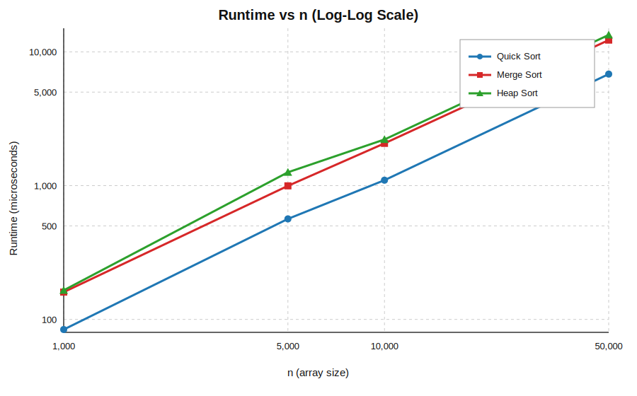

# Section 5 - Written Report

## 5.1 Completed Benchmarking Table (Section 4.3)

Measured runtimes below are medians of 3 runs, in microseconds.

| Algorithm | n=1,000 | n=5,000 | n=10,000 | n=50,000 | n=100,000 | n=500,000 |
| --- | ---: | ---: | ---: | ---: | ---: | ---: |
| Quick Sort | 84 | 564 | 1098 | 6818 | - | - |
| Merge Sort | 160 | 996 | 2070 | 12243 | - | - |
| Heap Sort | 165 | 1258 | 2213 | 13380 | - | - |
| Counting Sort | - | - | 781 | 1219 | 1813 | 8518 |
| Radix Sort | - | - | 846 | 4540 | 9505 | 52279 |

## 5.2 Log-Log Plot for Comparison Sorts

The three curves are close to straight lines on log-log axes, which is what we expect for near-polynomial growth. Using the first and last points, the fitted slopes are approximately $1.124$ (Quick), $1.109$ (Merge), and $1.124$ (Heap). This is consistent with $O(n \log n)$ behavior over finite ranges: the extra $\log n$ factor makes the observed slope slightly above $1$ instead of exactly $1$. A second check also agrees: $\frac{t}{n\log_2 n}$ stays fairly stable for each algorithm (Quick about $0.0083$ to $0.0092$, Merge about $0.0156$ to $0.0162$, Heap about $0.0166$ to $0.0205$).

## 5.3 Analysis Questions (10 Total)

### Quick Sort - Question 4

On random unique input, quick sort matched expected $O(n\log n)$ scaling in the measurements. The normalized value $\frac{t}{n\log_2 n}$ stayed near constant, from about $0.00786$ to $0.00834$ over $n=1000$ to $32000$. Runtime also grew from $78.333\,\mu s$ to $3926.000\,\mu s$, which tracks the increase in $n\log n$. This supports that the median-of-three pivot plus insertion cutoff is effective on random data.

### Quick Sort - Question 5

On equal-value input, quick sort behaved close to quadratic in this implementation. The normalized ratio $\frac{t}{n^2}$ stayed in a narrow band, from about $0.00128$ down to $0.00103$, while runtime jumped from $1278.667\,\mu s$ at $n=1000$ to $1057729.000\,\mu s$ at $n=32000$. This happens because Lomuto partition with condition `A[j] < pivot` creates highly unbalanced splits when many elements equal the pivot. So this variant has a clear worst-case risk despite good random-input performance.

### Merge Sort - Question 6

Measured comparison counts for merge sort scale proportionally to $n\log_2 n$. On random input, $\frac{\text{comparisons}}{n\log_2 n}$ ranged from about $0.872$ to $0.915$ as $n$ increased from $1000$ to $32000$. On equal input, the same ratio stayed around $0.504$ to $0.506$. The bounded ratios confirm $O(n\log n)$ comparison growth.

### Merge Sort - Question 7

Merge sort remains $O(n\log n)$ regardless of input order because it always performs balanced recursive splitting and linear merges per level. The measurements reflect this consistency: both random and equal cases rise smoothly without any blow-up. In contrast, quick sort is input sensitive in this implementation, and equal-input runs showed near-$O(n^2)$ growth. Therefore merge sort is more predictable across adversarial distributions.

### Heap Sort - Question 8

Heap sort showed $O(n\log n)$ scaling but was slower than quick sort on random input at the same sizes. In the benchmark table, at $n=50000$, heap sort took $13380\,\mu s$ while quick sort took $6818\,\mu s$, so heap sort was about $1.96\times$ slower. At $n=10000$, heap sort was $2213\,\mu s$ versus quick sort $1098\,\mu s$ (about $2.02\times$ slower). This is consistent with larger constant factors from sift-down swaps and less cache-friendly access.

### Heap Sort - Question 9

On random input, heap sort swap counts followed $n\log n$ very closely. The ratio $\frac{\text{swaps}}{n\log_2 n}$ stayed between about $0.914$ and $0.941$ from $n=1000$ to $32000$, while swaps grew from $9107$ to $450582$. On equal input, swaps were exactly $n-1$ in these runs (e.g., $999, 1999, \dots, 31999$), indicating linear behavior for that special case. So the measured random-case swap complexity supports the theoretical $O(n\log n)$ claim.

### Counting Sort - Question 10

Counting sort outperformed comparison sorts strongly when $k$ was small relative to $n$. With $k=1000$ and $n=32000$, counting sort was $342.000\,\mu s$, while merge and heap were $7118.667\,\mu s$ and $7859.333\,\mu s$. A $k$-sweep at fixed $n=32000$ showed runtime rising from $344.000\,\mu s$ at $k=1000$ to $7135.667\,\mu s$ at $k=10^6$, with count-array memory increasing from $4004$ bytes to $4000004$ bytes. This shows counting sort becomes impractical when $k$ is so large that $O(n+k)$ initialization and memory costs dominate.

### Counting Sort - Question 11

Counting sort is stable when the output placement loop runs right-to-left after prefix sums. If two equal keys occur at indices $i<j$, then index $j$ is placed in the later slot first and index $i$ is placed in the earlier slot, preserving their relative order. If placement is done left-to-right with the same decrement logic, equal keys are reversed and stability is lost. Stability is essential when counting sort is used as a subroutine in radix sort.

### Radix Sort - Question 12

For LSD radix sort, runtime is $O(d(n+b))$, so base choice trades off number of passes against per-pass overhead. With base $10$ and $\text{maxVal}=99999$, we get $d=5$ passes. At $n=32000$, radix was $2180.667\,\mu s$, faster than merge ($7229.333\,\mu s$) and heap ($7860.333\,\mu s$), but slower than counting sort ($958.000\,\mu s$) for the same key range. The data matches the model: multiple stable passes still beat comparison sorts here, but a single counting pass can be faster when feasible.

### Radix Sort - Question 13

Each digit pass in LSD radix sort must be stable so that ordering from less-significant digits is preserved. For example, with input $[21,22,11,12]$, a stable ones-digit pass gives $[21,11,22,12]$, and a stable tens-digit pass then yields fully sorted $[11,12,21,22]$. If the tens pass is unstable, items with the same tens digit can be permuted to produce outputs like $[12,11,22,21]$, which is not sorted. Therefore stability is not optional; it is required for correctness.

## 5.4 Scenario-Based Algorithm Choice

For (a) $n=1000$ integers in a 60 Hz game loop, I would choose quick sort because it had the lowest measured comparison-sort runtime ($84\,\mu s$) and very low constant cost on random unique data. For (b) sorting $500000$ player scores in range $0$ to $10000$, I would choose counting sort because the bounded key range makes $O(n+k)$ ideal, and counting sort was much faster than radix at large non-comparison sizes in the benchmark. For (c) sorting file names alphabetically, I would choose merge sort: counting/radix do not apply naturally to variable-length strings, and merge sort provides stable, predictable $O(n\log n)$ performance across inputs.
